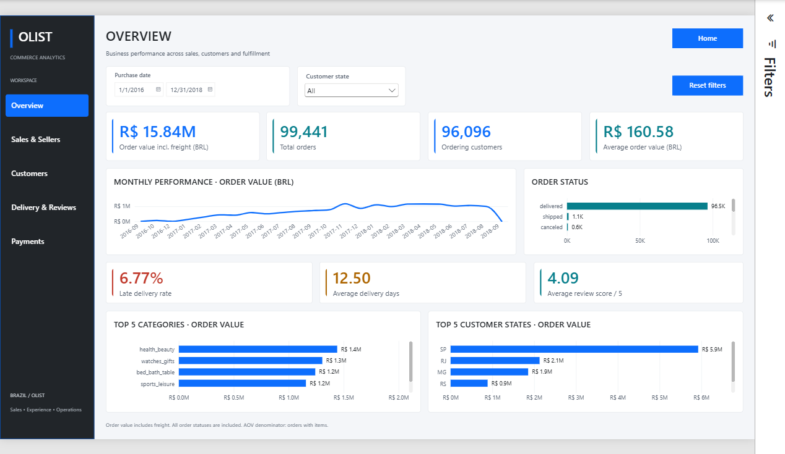
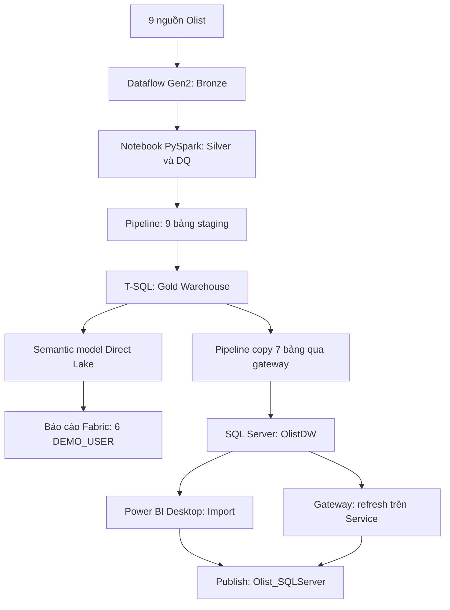

# Olist — End-to-End E-Commerce Analytics

Đồ án Data Engineering và Data Analytics với Microsoft Fabric, SQL Server và Power BI. Dữ liệu Olist được chuẩn hóa theo kiến trúc Bronze → Silver → Gold, rồi phục vụ báo cáo qua hai nhánh: Fabric Direct Lake và SQL Server Import qua gateway.

## Business impact

This project turns marketplace data into a reusable analytics product for four practical decisions:

- Commercial performance: order value, merchandise value, freight cost and average order value support sales and margin conversations.
- Customer retention: repeat customers, repeat rate and orders per customer help identify retention opportunities.
- Fulfillment quality: late delivery rate, delivery days and review scores show where operations affect customer experience.
- Payment behavior: payment value, paying orders, payment records and installments describe payment mix and transaction volume.

The two serving paths make the design useful in different settings: Fabric Direct Lake supports a cloud-first architecture, while SQL Server Import demonstrates a gateway-based path for teams that still operate on-premises. The model separates order, item and payment grains so metrics can be compared without multiplying facts through an unsafe fact-to-fact join.

This is a completed portfolio implementation with documented boundaries. The public release is a sanitized template: connections, tenant IDs and RLS identities must be remapped before deployment. See [public release notes](docs/public-release.md), [portfolio status](docs/portfolio-status.md), [limitations](docs/limitations.md), and the [MIT License](LICENSE).

> Đây là bản public đã thay thông tin môi trường bằng giá trị mẫu. Đọc [hướng dẫn cấu hình lại](docs/public-release.md) trước khi sử dụng.

## Bài toán kinh doanh

Theo dõi giá trị hàng hóa và vận chuyển, khách hàng mua lại, hiệu quả người bán, giao hàng trễ, đánh giá và phương thức thanh toán. Mỗi KPI có grain và phạm vi bộ lọc rõ ràng để tránh nhân đôi đơn hàng khi phân tích nhiều fact.

## Kiến trúc

## Kết quả đã xác minh

| Hạng mục | Kết quả / phạm vi |
|---|---|
| SQL model trên Service | 7 bảng nghiệp vụ, 33 measures, 9 quan hệ |
| Quan hệ trong bản SQL cục bộ | 8 Active, 1 ngày giao Inactive, lọc một chiều |
| Pipeline Gold → SQL Server | Cả 7 Copy Succeeded, 20/09/2026 |
| Gateway và refresh | Mapping đúng; refresh On demand Completed trong 27 giây |
| RLS Fabric | Pilot SP đã kiểm tra XMLA; web test bị bỏ qua do SSO |
| Lịch refresh / RLS SQL | Lịch Off; SQL model chưa có role |

| Chỉ số toàn bộ dữ liệu | Giá trị |
|---|---:|
| Đơn hàng | 99,441 |
| Order items | 112,650 |
| Khách hàng đặt hàng | 96,096 |
| Giá trị hàng hóa, BRL | 13,591,643.70 |
| Phí vận chuyển, BRL | 2,251,909.54 |
| Giá trị đơn gồm vận chuyển, BRL | 15,843,553.24 |
| Giá trị thanh toán, BRL | 16,008,872.12 |

Kết quả Service được kiểm tra ngày 21/09/2026 và khớp SQL đã đối soát. Đây không phải phép so sánh hai nguồn trong một snapshot mới đồng thời. Các kiểm tra E2E/DQ từ giai đoạn trước chỉ được đánh dấu đạt khi có bằng chứng; xem [ma trận kiểm thử](docs/testing.md).

## Báo cáo

Overview; Sales & Sellers; Customers; Delivery & Reviews; Payments. Bản Fabric có thêm Data Health. Sidebar chuyển DEMO_USER và nút Home quay về Overview. Thiết kế tham khảo AdminLTE; toàn bộ visuals triển khai bằng Power BI native.

## Bắt đầu

1. Đọc [runbook](docs/runbook.md), chuẩn bị nguồn dữ liệu và quyền truy cập.
2. Dựng Silver/Gold theo notebook và SQL; cấu hình pipeline theo tài liệu.
3. Mở `powerbi/Olist_SQLServer.pbip` để dùng nhánh Import, hoặc `powerbi/RPT_Olist_Analytics.pbip` với quyền truy cập model Fabric đã triển khai.
4. Với máy khác, thay server/connection/workspace theo [hướng dẫn chuyển môi trường](docs/runbook.md#chuyển-sang-môi-trường-khác).

PBIP không chứa dữ liệu Import cache để chạy ngay trên máy mới. Cần SQL Server có dữ liệu và Refresh. File report Fabric liên kết model trên tenant, không phải bản triển khai độc lập của model đó.

## Tài liệu

- [Kiến trúc và lựa chọn thiết kế](docs/architecture.md)
- [Data dictionary](docs/data-dictionary.md)
- [KPI và toàn bộ DAX của SQL model](docs/kpi-definitions.md)
- [Vận hành, triển khai và xử lý lỗi](docs/runbook.md)
- [Kiểm thử và bằng chứng](docs/testing.md)
- [Giới hạn](docs/limitations.md)
- [Kịch bản demo](docs/demo-script.md)
- [Chuẩn bị GitHub](docs/github-release.md)
- [Nguồn và ghi nhận](docs/sources.md)
- [Biên bản đóng gói giai đoạn 10](docs/phase-10-completion.md)

## Cấu trúc mã nguồn

`fabric/notebooks/`: Silver và DQ; `fabric/sql/`: staging, Gold và validation; `fabric/dataflows/`: bản Power Query reviews; `sql/`: provisioning và đối soát SQL Server; `powerbi/`: PBIP/PBIR/TMDL, script tạo báo cáo; `docs/`: hướng dẫn và bằng chứng.

Đã bổ sung Dataflow, 4 pipeline template và 2 notebook export từ Fabric. Xem [hướng dẫn import và đối chiếu](docs/fabric-export-review.md). Còn thiếu export semantic model Direct Lake và đối chiếu DDL cloud. Dữ liệu nguồn và các artifact lớn không được đưa vào Git mặc định.
