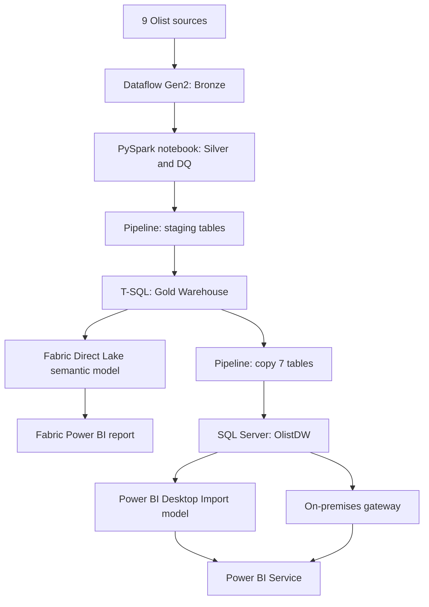

# Olist End-to-End E-Commerce Analytics

An end-to-end data engineering and analytics portfolio project built with Microsoft Fabric, SQL Server, and Power BI. Olist marketplace data is processed through Bronze, Silver, and Gold layers and served through both a cloud-native Fabric path and an on-premises SQL Server path.

> This public repository is a sanitized template. Tenant IDs, connections, hostnames, GUIDs, and RLS identities are sample values. Read [Public release notes](docs/public-release.md) before using it.

## Business problem

The project answers four operational questions:

- How much value is generated by orders, products, freight, and payments?
- Which customers return and how does customer geography relate to activity?
- Where do late deliveries affect reviews and customer experience?
- Which payment methods and installment patterns dominate transaction volume?

The model keeps order, item, and payment grains separate so measures do not multiply facts through an unsafe fact-to-fact join.

## Business impact

- **Commercial performance:** order value, merchandise value, freight cost, and average order value support sales and margin conversations.
- **Customer retention:** repeat customers, repeat rate, and orders per customer identify retention opportunities.
- **Fulfillment quality:** late delivery rate, delivery days, and review scores show where operations affect customer experience.
- **Payment behavior:** payment value, paying orders, payment records, and installments describe payment mix and transaction volume.

The two serving paths demonstrate a cloud-first Direct Lake architecture and a gateway-based Import architecture for teams that still operate on-premises.

## Architecture

## Verified results

| Metric | Value |
|---|---:|
| Orders | 99,441 |
| Order items | 112,650 |
| Ordering customers | 96,096 |
| Merchandise value (BRL) | 13,591,643.70 |
| Freight value (BRL) | 2,251,909.54 |
| Order value including freight (BRL) | 15,843,553.24 |
| Payment value (BRL) | 16,008,872.12 |

The SQL Server semantic model contains 7 business tables, 33 measures, 8 active relationships, and 1 inactive delivery-date relationship. The Fabric model includes the technical GoldLoadAudit table and the CustomerStateAccess RLS pilot.

## Reports

The report pages are Overview, Sales & Sellers, Customers, Delivery & Reviews, and Payments. The Fabric report also includes Data Health. A native Power BI sidebar changes pages and a Home action returns to Overview. The visual design is inspired by AdminLTE; all visuals are native Power BI visuals.

## Repository contents

- `fabric/`: Dataflow, notebooks, pipeline exports/templates, semantic model TMDL, and Fabric SQL.
- `sql/`: SQL Server provisioning and reconciliation scripts.
- `powerbi/`: PBIP/PBIR reports, TMDL model, report build scripts, and reviewed screenshots.
- `docs/`: architecture, KPI definitions, runbook, testing evidence, limitations, and public release notes.

## Getting started

1. Read [the runbook](docs/runbook.md) and [public release notes](docs/public-release.md).
2. Prepare a Fabric workspace, Lakehouses, Warehouse, SQL Server, and gateway connections.
3. Import the Dataflow template, notebooks, and pipeline templates. Replace all sample IDs and connections.
4. Run Silver DQ, staging, Gold build, SQL reconciliation, and the report refresh in that order.
5. Open `powerbi/Olist_SQLServer.pbip` for the SQL Server Import path or connect `RPT_Olist_Analytics.pbip` to the Fabric semantic model.

PBIP does not contain an Import cache for a new machine. The SQL Server database must be populated before refreshing the Import model. The Fabric report references a tenant semantic model and is not a standalone copy of that tenant.

## Documentation

- [Architecture](docs/architecture.md)
- [Data dictionary](docs/data-dictionary.md)
- [KPI definitions](docs/kpi-definitions.md)
- [Runbook](docs/runbook.md)
- [Testing and evidence](docs/testing.md)
- [Limitations and next steps](docs/limitations.md)
- [Portfolio status](docs/portfolio-status.md)
- [Demo script](docs/demo-script.md)
- [Fabric export review](docs/fabric-export-review.md)
- [Public release notes](docs/public-release.md)
- [Backup strategy](docs/backup-strategy.md)
- [MIT License](LICENSE)

## Portfolio status

The implementation, reports, exports, evidence, and documentation are complete for portfolio review. Production hardening remains explicitly documented: SQL RLS, scheduled refresh, clean-tenant deployment, and a fresh DQ failure/recovery run.
