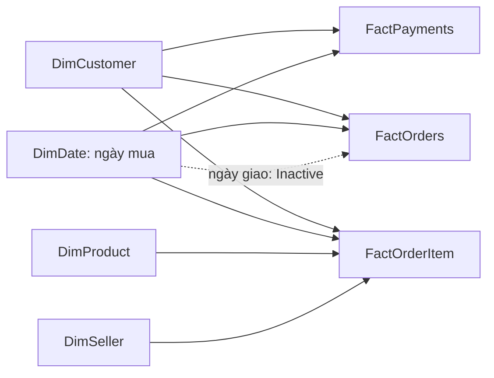

# Kiến trúc và quyết định thiết kế

## Luồng dữ liệu

9 nguồn: orders, order_items, customers, products, sellers, payments, reviews, geolocation và category translation. Dataflow Gen2 nạp Bronze; notebook đọc Bronze, chuẩn hóa kiểu dữ liệu/khóa/ZIP, xử lý dữ liệu trùng và kiểm tra DQ trước khi ghi Silver.

Silver có 10 bảng nghiệp vụ và audit DQ. 9 bảng được copy sang staging; `slv_geolocation_zip` không copy riêng vì tọa độ đã ghép vào customer/seller. Procedure `dbo.usp_build_gold` kiểm tra đúng Silver run_id rồi xây 4 dimension + 3 fact và GoldLoadAudit.

Pipeline dự kiến vận hành: DF_Bronze → NB_Silver → LOAD_Staging → SP_Build_Gold, nối On success, chờ pipeline con hoàn tất. Hướng dẫn cấu hình nằm trong [giai đoạn 6](phase-6-e2e-pipeline.md); việc có hướng dẫn không chứng minh các test lỗi/rerun đã chạy.

## Hai nhánh phục vụ

| Nhánh | Dữ liệu và model | Report |
|---|---|---|
| Fabric | Gold Warehouse → SM_Olist_Analytics, Direct Lake; có thêm GoldLoadAudit | RPT_Olist_Analytics, 6 DEMO_USER |
| SQL Server | Copy 7 bảng Gold → OlistDW → Import model; gateway refresh | Olist_SQLServer, 5 DEMO_USER |

Gateway được dùng cho truy cập SQL Server tại máy cục bộ. Copy Warehouse → SQL Server là luồng nạp, còn refresh Service đọc SQL Server vào model Import là luồng riêng.

## Mô hình quan hệ

Mỗi dimension lọc fact theo 1:n, một chiều. Không nối trực tiếp fact với fact. `order_id` dùng để đối soát grain nghiệp vụ, không phải quan hệ tự động giữa các fact. Ngày giao được kích hoạt trong measure bằng USERELATIONSHIP; estimated_date_key không có quan hệ model.

## Các giới hạn thiết kế có chủ đích

- Full rebuild phù hợp bộ dữ liệu tĩnh của đồ án. Khóa ROW_NUMBER ổn định trên nguồn không đổi, có thể thay đổi khi nguồn thay đổi; phải nạp đồng bộ toàn bộ bảng liên quan.
- Customer geography dùng bản ghi hiện tại, không phải lịch sử địa chỉ theo từng đơn (không SCD2).
- Nạp SQL hiện truncate/insert từng bảng; chưa có staging/promote nguyên batch. Chỉ refresh model sau khi cả 7 copy hoàn tất và đối soát đạt.
- GoldLoadAudit độc lập với dimension nghiệp vụ. Role Fabric chặn audit bằng FALSE(); SQL report bỏ Data Health vì chưa nạp audit.
- Không có distributed lock; vận hành một lượt nạp tại một thời điểm.
